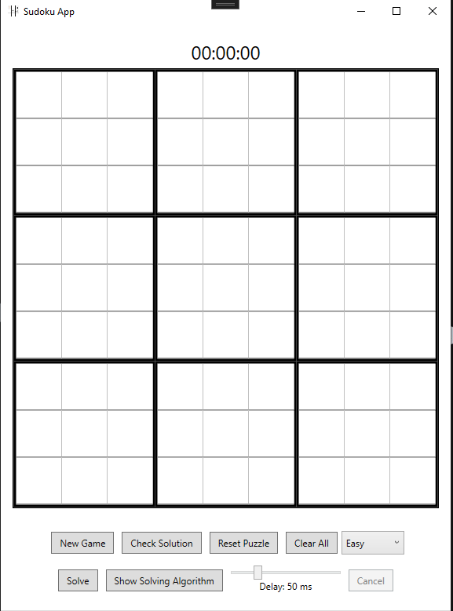
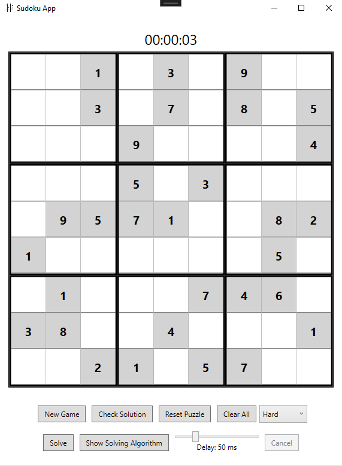
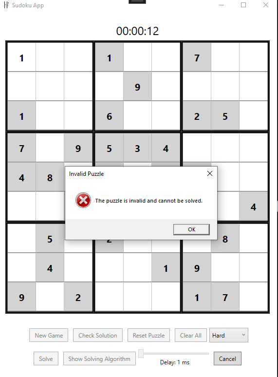
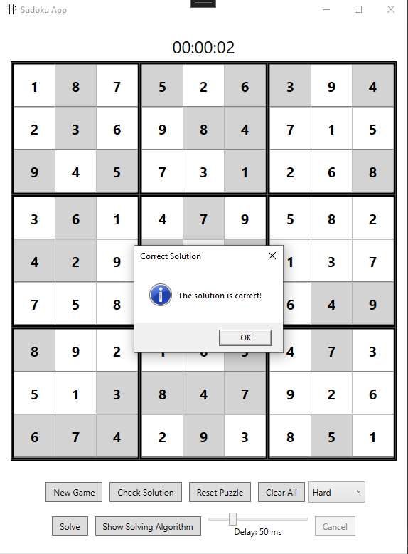

# Sudoku Solver and Generator

This repository contains a C# WPF application that can both solve and generate Sudoku puzzles. The application provides a user-friendly interface to input, solve, or generate Sudoku puzzles, and it can also check the solution for correctness. Additionally, the application features a backtracking visualization to help users understand the solving process, and a difficulty level setting for generated puzzles.

## Features

   - Solve Sudoku puzzles with the click of a button
   - Generate new Sudoku puzzles with varying levels of difficulty: easy, medium, hard, and evil
   - Check the correctness of a filled-in Sudoku puzzle
   - User-friendly interface for easy interaction
   - Backtracking visualization for a step-by-step insight into the solving process
   - Adjustable visualization speed to control the pace of the solving algorithm
   - Choose the difficulty level for generated Sudoku puzzles

## Usage

The application provides a simple interface for users to interact with Sudoku puzzles. You can either input your own Sudoku puzzle or generate a new one by choosing a difficulty level from the dropdown menu. To solve the puzzle, click the "Solve" button. To check the correctness of a filled-in Sudoku puzzle, click the "Check" button.

    

        
    

    

        
Figure 1: Sudoku Start Screen

    

<!-- This image shows the initial screen of the Sudoku application, where users can start a new game or load an existing one. -->

To visualize the backtracking algorithm in action, click the "Visualize Solve" button. The solving process will be displayed step-by-step, showing the algorithm's decisions and backtracks. You can adjust the visualization speed using the slider to control the pace of the solving algorithm.

## Difficulty Settings

The difficulty settings for the puzzle generation feature are determined by the number of cells removed from a completed puzzle grid. However, please note that the perceived difficulty of a puzzle for human solvers can be quite subjective and may not always align with these settings. For example, an "easy" puzzle might still contain challenging sections, and a "hard" puzzle might contain straightforward sections. The current method of setting difficulty levels is a simple and common approach, but it does not guarantee a uniform difficulty experience throughout the puzzle.

    

        
    

    

        
Figure 2: Hard Sudoku Puzzle

    

<!-- This image shows an example of a hard Sudoku puzzle generated by the application. -->

    

        
    

    

        
Figure 3: Invalid Sudoku Puzzle

    

<!-- This image demonstrates a case where the Sudoku puzzle filled by the user is invalid. The application provides functionality to check the correctness of the solution. -->

    

        
    

    

        
Figure 4: Correct Sudoku Puzzle

    

<!-- This image shows a correctly solved Sudoku puzzle, indicating that the user has successfully completed the puzzle. -->
